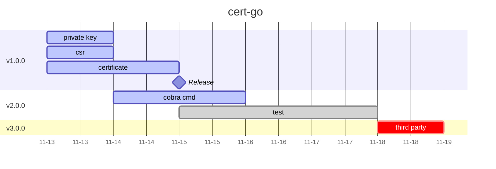

# cert-go

This package is a golang command line tool implementation of self-signing certificates.

Also, we expected to link third party CA certificates to generate certificates in the future.

## Roadmap



## Develop Environment

|Type|Version|
|-|-|
|OS|ubuntu 22.04.5|
|Golang|go1.22.5 linux/amd64|

## Usage

1. Prepare the destination directory for the private key, certificate, and CSR. This step is required for all the following steps.

2. Modify the `cfg.yml` file to set the appropriate values(you can use the `defaultCfg.yml` file as your template).

   [Click here to see the default configuration file](./defaultCfg.yml)

3. Import the `certgo` package in your code.

    ```go
    import "github.com/Alonza0314/cert-go"
    ```

4. For create private key, you need to specify the path of the destination file. Then, use this function:

    ```go
    CreatePrivateKey(keyPath string) (*ecdsa.PrivateKey, error)
    ```

    The return value is the private key in `*ecdsa.PrivateKey` type.

5. For create csr, you need to specify the [certificate structure](./model/model_certificate.go). You can use `ReadYamlFileToStruct` function to read the configuration file and convert it to the certificate structure.

    ```go
    util.ReadYamlFileToStruct(yamlPath string, v interface{}) error
    ```

    Then, use this function:

    ```go
    CreateCsr(cfg model.Certificate) (*x509.CertificateRequest, error)
    ```

    The return value is the csr in `*x509.CertificateRequest` type.

6. For sign certificate, you need to specify the yaml file path of the CA configuration. Then, use these functions for different types of certificates:

    ```go
    SignRootCertificate(yamlPath string) ([]byte, error)
    SignIntermediateCertificate(yamlPath string) ([]byte, error)
    SignServerCertificate(yamlPath string) ([]byte, error)
    SignClientCertificate(yamlPath string) ([]byte, error)
    ```

    The return value is the signed certificate in `[]byte` type after encoding to PEM format.

7. In the end, it is expected to see the private key, certificate, and csr in the destination directory.

## Example

[Click here to see the example](./example/)

## Test

```bash
mkdir -p ./default_ca/root ./default_ca/intermediate ./default_ca/server ./default_ca/client
go test ./... -v
```

## Command Line Tool

### Build by Yourself(in root directory)

```bash
./build_cmd.sh
```

Then, you can find the executable file in the [build](./build) directory.

### Use Directly

TBA

[Click here to see the command line tool in detail](./cmd/)

## About Me

[Click here to know more about me](https://alonza0314.github.io/)
